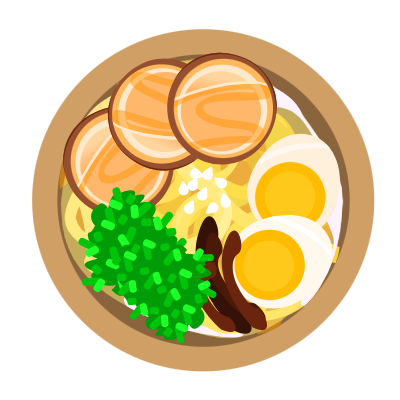

<!-- Improved compatibility of back to top link: See: https://github.com/othneildrew/Best-README-Template/pull/73 -->
<a name="readme-top"></a>
<!--
*** Thanks for checking out the Best-README-Template. If you have a suggestion
*** that would make this better, please fork the repo and create a pull request
*** or simply open an issue with the tag "enhancement".
*** Don't forget to give the project a star!
*** Thanks again! Now go create something AMAZING! :D
-->


<!-- PROJECT SHIELDS -->
<!--
*** I'm using markdown "reference style" links for readability.
*** Reference links are enclosed in brackets [ ] instead of parentheses ( ).
*** See the bottom of this document for the declaration of the reference variables
*** for contributors-url, forks-url, etc. This is an optional, concise syntax you may use.
*** https://www.markdownguide.org/basic-syntax/#reference-style-links
-->
[![Contributors][contributors-shield]][contributors-url]
[![Forks][forks-shield]][forks-url]
[![Stargazers][stars-shield]][stars-url]
[![Issues][issues-shield]][issues-url]
[![MIT License][license-shield]][license-url]


<!-- PROJECT LOGO -->
<br />
<div align="center">
  <a href="https://github.com/stenwall-io/cook-book">
    
  </a>

<h3 align="center">Cook Book</h3>

  <p align="center">
    An easier way of planning meals.
    <br />
    <a href="https://github.com/stenwall-io/cook-book"><strong>Explore the docs »</strong></a>
    <br />
    <br />
    <a href="https://github.com/stenwall-io/cook-book">View Demo</a>
    ·
    <a href="https://github.com/stenwall-io/cook-book/issues">Report Bug</a>
    ·
    <a href="https://github.com/stenwall-io/cook-book/issues">Request Feature</a>
  </p>
</div>


<!-- TABLE OF CONTENTS -->
<details>
  <summary>Table of Contents</summary>
  <ol>
    <li>
      <a href="#about-the-project">About The Project</a>
      <ul>
        <li><a href="#built-with">Built With</a></li>
      </ul>
    </li>
    <li>
      <a href="#getting-started">Getting Started</a>
      <ul>
        <li><a href="#prerequisites">Prerequisites</a></li>
        <li><a href="#installation">Installation</a></li>
      </ul>
    </li>
    <li><a href="#usage">Usage</a></li>
    <li><a href="#roadmap">Roadmap</a></li>
    <li><a href="#contributing">Contributing</a></li>
    <li><a href="#license">License</a></li>
    <li><a href="#contact">Contact</a></li>
    <li><a href="#acknowledgments">Acknowledgments</a></li>
  </ol>
</details>


<!-- ABOUT THE PROJECT -->
## About The Project

<!-- [![Product Name Screen Shot][product-screenshot]](https://example.com) -->

<p align="right">(<a href="#readme-top">back to top</a>)</p>


### Built With

<!-- * [![Next][Next.js]][Next-url] -->
* [Next.js][Next-url]
* [mongoose][mongoose-url]
* [Material UI][materialui-url]

<p align="right">(<a href="#readme-top">back to top</a>)</p>


<!-- GETTING STARTED -->
## Getting Started


### Prerequisites

* [Node](https://nodejs.org/en/) version 18.13.0
* [Yarn](https://yarnpkg.com/) version 3.1.0

### Installation

Install dependencies

```bash
yarn install
```

Run develop environment

```bash
yarn dev
```


<p align="right">(<a href="#readme-top">back to top</a>)</p>

<!-- API ENDPOINTS -->
## API endpoints

### Model URIs for recipes

| Methods | URLs | Actions |
|---|---|---|
| POST | `/recipes` | create new recipe |
| GET | `/recipes` | list all recipes |
| GET | `/recipes/:recipeId` | get given recipe |
| PUT | `/recipes/:recipeId` | update given recipe |
| DELETE | `/recipes/:recipeId` | delete given recipe |

### Model URIs for plans

| Methods | URLs | Actions |
|---|---|---|
| POST | `/plans` | create new plan |
| GET | `/plans` | list all plans |
| GET | `/plans/:planId` | get given plan |
| PUT | `/plans/:planId` | update given plan |
| DELETE | `/plans/:planId` | delete given plan |
| PUT | `/plans/:planId/recipes/:recipeId` | add recipe to plan |

### Model URIs for ingredients

| Methods | URLs | Actions |
|---|---|---|
| POST | `/ingredients` | create new ingredient |
| GET | `/ingredients` | list all ingredients |
| GET | `/ingredients/:ingredientId` | get given ingredient |
| PUT | `/ingredients/:ingredientId` | update given ingredient |
| DELETE | `/ingredients/:ingredientId` | delete given ingredient |

### Model URIs for tags

| Methods | URLs | Actions |
|---|---|---|
| POST | `/tags` | create new tag |
| GET | `/tags` | list all tags |
| GET | `/tags/:tagId` | get given tag |
| PUT | `/tags/:tagId` | update given tag |
| DELETE | `/tags/:tagId` | delete given tag |


<!-- USAGE EXAMPLES -->
## Usage


<p align="right">(<a href="#readme-top">back to top</a>)</p>


<!-- ROADMAP -->
## Roadmap

- [ ] Feature 1
- [ ] Feature 2
- [ ] Feature 3
    - [ ] Nested Feature

See the [open issues](https://github.com/stenwall-io/cook-book/issues) for a full list of proposed features (and known issues).

<p align="right">(<a href="#readme-top">back to top</a>)</p>


<!-- CONTRIBUTING -->
## Contributing

Contributions are what make the open source community such an amazing place to learn, inspire, and create. Any contributions you make are **greatly appreciated**.

If you have a suggestion that would make this better, please fork the repo and create a pull request. You can also simply open an issue with the tag "enhancement".
Don't forget to give the project a star! Thanks again!

1. Fork the Project
2. Create your Feature Branch (`git checkout -b feature/AmazingFeature`)
3. Commit your Changes (`git commit -m 'Add some AmazingFeature'`)
4. Push to the Branch (`git push origin feature/AmazingFeature`)
5. Open a Pull Request

<p align="right">(<a href="#readme-top">back to top</a>)</p>


<!-- LICENSE -->
## License

Distributed under the MIT License. See `LICENSE.txt` for more information.

<p align="right">(<a href="#readme-top">back to top</a>)</p>


<!-- CONTACT -->
## Contact

Project Link: [https://github.com/stenwall-io/cook-book](https://github.com/stenwall-io/cook-book)

<p align="right">(<a href="#readme-top">back to top</a>)</p>


<!-- ACKNOWLEDGMENTS -->
## Acknowledgments

* []()
* []()
* [asdf](TUT)

<p align="right">(<a href="#readme-top">back to top</a>)</p>


<!-- MARKDOWN LINKS & IMAGES -->
<!-- https://www.markdownguide.org/basic-syntax/#reference-style-links -->
[contributors-shield]: https://img.shields.io/github/contributors/stenwall-io/cook-book.svg?style=for-the-badge
[contributors-url]: https://github.com/stenwall-io/cook-book/graphs/contributors
[forks-shield]: https://img.shields.io/github/forks/stenwall-io/cook-book.svg?style=for-the-badge
[forks-url]: https://github.com/stenwall-io/cook-book/network/members
[stars-shield]: https://img.shields.io/github/stars/stenwall-io/cook-book.svg?style=for-the-badge
[stars-url]: https://github.com/stenwall-io/cook-book/stargazers
[issues-shield]: https://img.shields.io/github/issues/stenwall-io/cook-book.svg?style=for-the-badge
[issues-url]: https://github.com/stenwall-io/cook-book/issues
[license-shield]: https://img.shields.io/github/license/stenwall-io/cook-book?label=license&style=for-the-badge
[license-url]: https://github.com/stenwall-io/cook-book/blob/master/LICENSE.txt
[linkedin-shield]: https://img.shields.io/badge/-LinkedIn-black.svg?style=for-the-badge&logo=linkedin&colorB=555
[linkedin-url]: https://linkedin.com/in/linkedin_username
[product-screenshot]: assets/screenshot.png
[next-url]: https://nextjs.org/
[mongoose-url]: https://mongoosejs.com/
[materialui-url]: https://mui.com/
